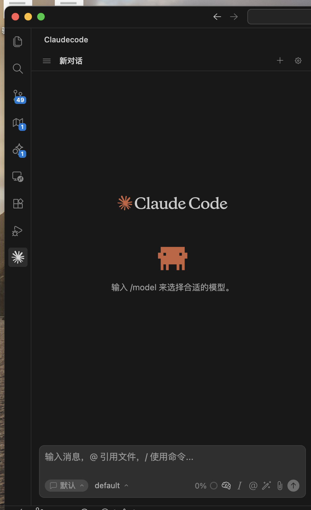

# Claude code - AI 智能编程助手

<p align="center">
  
</p>

<p align="center">
  <strong>多协议 AI 智能编程助手，支持 Claude Code、OpenAI、Anthropic、Gemini 多种服务提供商</strong>
</p>

<p align="center">
  
  
  
  
</p>

<p align="center">
  
</p>

---

## 目录

- [功能特性](#功能特性)
- [系统要求](#系统要求)
- [安装指南](#安装指南)
- [配置说明](#配置说明)
- [使用指南](#使用指南)
- [开发指南](#开发指南)
- [常见问题](#常见问题)
- [贡献指南](#贡献指南)
- [许可证](#许可证)

---

## 功能特性

### 核心功能

- **🤖 多模型支持** — 支持 Claude、OpenAI、Gemini 等多种 AI 服务
- **⚙️ 自定义配置** — 灵活配置 API Key、Base URL、模型 ID
- **💬 流式对话** — 实时流式输出，完整的 Markdown 渲染支持
- **🛠️ 工具调用** — 集成文件读写、终端命令、内容搜索、网页搜索、批量编辑等工具

### 高级功能

- **📁 会话管理** — 支持多会话、历史记录、消息队列管理
- **📎 拖拽附件** — 图片拖入作为附件，文件拖入快速插入路径
- **📝 追加规则** — 自定义指令模板，每次对话自动追加规则
- **🔌 MCP 扩展** — 完整支持 Model Context Protocol 工具集成
- **🎨 现代化 UI** — 基于 Vue 3 + Tailwind CSS 的响应式界面

---

## 系统要求

| 组件 | 版本要求 |
|------|---------|
| VSCode | >= 1.98.0 |
| Node.js | >= 18.0.0 |
| pnpm | >= 8.0.0 |

---

## 安装指南

### 方式一：从源码构建（推荐开发者）

```bash
# 克隆仓库
git clone https://github.com/crispvibe/Claudecode.git
cd Claudecode

# 安装依赖
pnpm install

# 构建项目
pnpm build

# 打包扩展
pnpm package
```

生成的 `.vsix` 文件位于项目根目录。

### 方式二：从 VSIX 文件安装

1. 在 VSCode 中打开扩展面板（`Ctrl+Shift+X` / `Cmd+Shift+X`）
2. 点击 **...** 菜单 → **从 VSIX 安装**
3. 选择下载的 `.vsix` 文件
4. 重启 VSCode

---

## 配置说明

### 基础配置

打开 VSCode 设置（`Ctrl+,` / `Cmd+,`），搜索 `claudix` 查看所有配置选项。

#### 1. API 配置

| 配置项 | 说明 | 示例 |
|-------|------|------|
| `claudix.apiKey` | API 密钥（留空使用本地 CLI 认证） | `sk-ant-...` |
| `claudix.baseUrl` | 自定义 API 地址（用于反代/自部署） | `https://api.example.com` |

#### 2. 模型配置

```json
{
  "claudix.defaultHaikuModel": "claude-3-5-haiku-20241022",
  "claudix.defaultSonnetModel": "claude-3-5-sonnet-20241022",
  "claudix.defaultOpusModel": "claude-3-5-opus-20241022",
  "claudix.reasoningModel": "claude-3-7-sonnet-20250219"
}
```

#### 3. 自定义模型

在 `claudix.customModels` 中添加自定义模型：

```json
{
  "claudix.customModels": [
    {
      "id": "gpt-4",
      "label": "GPT-4",
      "description": "OpenAI GPT-4 模型"
    },
    {
      "id": "gemini-2.0-flash",
      "label": "Gemini 2.0 Flash",
      "description": "Google Gemini 2.0 Flash 模型"
    }
  ]
}
```

#### 4. 追加规则

自定义每次对话自动追加的指令规则：

```json
{
  "claudix.appendRule": "不要猜测，必须找出问题。调用快速上下文...",
  "claudix.appendRuleEnabled": true
}
```

#### 5. 环境变量

配置启动 AI 时的环境变量：

```json
{
  "claudix.environmentVariables": [
    {
      "name": "ANTHROPIC_API_KEY",
      "value": "sk-ant-..."
    }
  ]
}
```

### 快速设置步骤

1. 点击侧边栏 **Claudecode** 图标
2. 点击右上角 **⚙️ 设置** 按钮
3. 填写 API Key 和 Base URL
4. 选择或添加模型
5. 点击保存，开始对话

---

## 使用指南

### 基本操作

- **新建会话** — 点击 **+** 按钮创建新对话
- **删除会话** — 右键会话名称 → 删除
- **发送消息** — 在输入框输入内容，按 `Enter` 发送
- **上传附件** — 拖拽图片或文件到输入框

### 工具调用

扩展自动集成以下工具，在对话中可直接使用：

- **文件操作** — 读取、编辑、创建文件
- **终端命令** — 执行 shell 命令
- **内容搜索** — 在项目中搜索代码
- **网页搜索** — 搜索互联网信息
- **批量编辑** — 同时修改多个文件

### 高级技巧

- 使用 **追加规则** 统一对话风格和要求
- 配置 **MCP 工具** 扩展功能
- 使用 **自定义模型** 切换不同 AI 服务

---

## 开发指南

### 开发环境设置

```bash
# 安装依赖
pnpm install

# 启动开发服务器（热更新）
pnpm dev

# 在另一个终端监听扩展变化
pnpm watch:extension
```

### 构建命令

| 命令 | 说明 |
|------|------|
| `pnpm dev` | 启动开发服务器（Webview + 扩展） |
| `pnpm build` | 构建 Webview 和扩展 |
| `pnpm build:webview` | 仅构建 Webview |
| `pnpm build:extension` | 仅构建扩展 |
| `pnpm watch` | 监听文件变化（Webview + 扩展） |
| `pnpm package` | 打包为 VSIX 文件 |
| `pnpm test` | 运行测试 |
| `pnpm lint` | 代码检查 |
| `pnpm format` | 代码格式化 |

### 项目结构

```
Claudecode/
├── src/
│   ├── extension/          # VSCode 扩展主程序
│   ├── services/           # 服务层（Claude SDK、处理器等）
│   ├── webview/            # Vue 3 Webview 界面
│   │   ├── src/
│   │   │   ├── components/ # Vue 组件
│   │   │   ├── pages/      # 页面组件
│   │   │   └── composables/# 组合式 API
│   │   └── vite.config.ts  # Vite 配置
│   └── shared/             # 共享代码
├── resources/              # 资源文件（图标、截图等）
├── package.json            # 项目配置
└── esbuild.ts              # esbuild 配置
```

### 技术栈

- **前端框架** — Vue 3 + TypeScript
- **构建工具** — Vite + esbuild
- **样式** — Tailwind CSS
- **AI SDK** — Claude Agent SDK + Anthropic SDK
- **协议** — Model Context Protocol (MCP)

### 代码规范

- 使用 TypeScript 编写代码
- 遵循 ESLint 规则
- 使用 Prettier 格式化代码
- 提交前运行 `pnpm format` 和 `pnpm lint:fix`

---

## 常见问题

### Q: 如何使用自己的 API Key？

A: 在设置中填写 `claudix.apiKey`，或设置环境变量 `ANTHROPIC_API_KEY`。

### Q: 支持哪些 AI 模型？

A: 支持 Claude、OpenAI、Google Gemini 等。在 `claudix.customModels` 中配置自定义模型。

### Q: 如何离线使用？

A: 配置 `claudix.baseUrl` 指向本地部署的 API 服务。

### Q: 如何贡献代码？

A: 详见 [贡献指南](#贡献指南) 部分。

### Q: 遇到问题如何反馈？

A: 在 [GitHub Issues](https://github.com/crispvibe/Claudecode/issues) 提交问题。

---

## 贡献指南

欢迎提交 Issue 和 Pull Request！

### 提交 PR 前

1. Fork 本仓库
2. 创建特性分支 (`git checkout -b feature/AmazingFeature`)
3. 提交更改 (`git commit -m 'Add some AmazingFeature'`)
4. 推送到分支 (`git push origin feature/AmazingFeature`)
5. 开启 Pull Request

### 代码要求

- 通过 ESLint 检查
- 通过 TypeScript 类型检查
- 添加必要的测试
- 更新相关文档

---

## 许可证

[AGPL-3.0](https://www.gnu.org/licenses/agpl-3.0.html) — 基于 [Claudix](https://github.com/Haleclipse/Claudix) © Haleclipse

### 鸣谢

感谢 [Haleclipse](https://github.com/Haleclipse) 开发的 [Claudix](https://github.com/Haleclipse/Claudix) 项目，本项目基于其二次开发。
